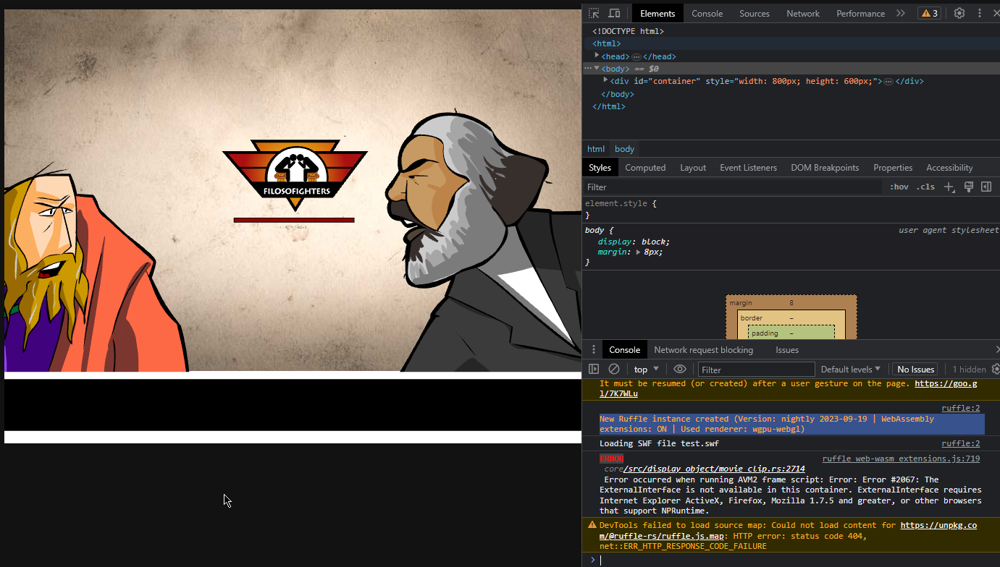

# Filosofighters
Mod do jogo Filosofighters para que ainda possa ser jogado hoje em dia.

Índice:
- [A parte principal](#a-parte-principal)
- [A parte entediante](#a-parte-entediante)

## A parte principal
Fiz esse mod do jogo a pedido da minha professora de filosofia, que queria mostrar para os alunos o jogo Filosofighters, [mas que foi retirado do ar](https://super.abril.com.br/multimidia/filosofighters-631063.shtml).

Então, com um pouco de paciência e conhecimento de computadores, consegui fazer com que o jogo seja pelo menos parcialmente jogavel.

### Downloads
#### [**Clique em mim para baixar.**](https://github.com/princessmortix/filosofighters/releases/latest)

### AVISO
> [!NOTE]  
> Leia com atenção essa parte. Não lendo as linhas abaixo pode resultar em um jogo totalmente congelado!

Não foi possível recuperar todos os arquivos do jogo, abaixo tem uma tabela com os personagens jogáveis:

| **Personagens jogaveis** | Você pode jogar contra |
|--------------------------|------------------------|
| Marx                     | Platão                 |
| Platão                   | Marx                   |
| Sto. Agostinho           | Platão e Marx          |
| Maquiavel                | Marx e Platão          |

Em resumo, **você pode jogar sendo Marx, Platão, Santo Agostinho ou Maquiavel**, porém você pode **lutar contra apenas Platão e Marx**.

Ignorar esta recomendação fazerá com que o jogo trave, sendo necessário reiniciar o aplicativo.

***

## A parte entediante
Aqui, explicarei como fiz o mod do jogo.

### Informações básicas
- A porta 4444 é usada;
- Um servidor local http com os arquivos extra do jogo é necessário (criado e fechado automaticamente);
- Usar o Flash Player Standalone não funciona;
- Ruffle é necessário.

### A caçada
Minha primeira ação depois de me oferecer para tentar fazer o jogo funcionar foi inspecionar [a página no Wayback](http://web.archive.org/web/20160214191742/https://super.abril.com.br/multimidia/filosofighters-631063.shtml). Encontrei a referencia do site "http://filosofighters.super.abril.com.br/filosofighters.php" que carregava o arquivo swf principal do jogo, então joguei a url no Wayback machine novanente, que levou ao [download do arquivo original](http://web.archive.org/web/20160214191742/http://filosofighters.super.abril.com.br/filosofighters.php), então pensei que era somente jogar no Flash Player e partir para o abraço.

Infelizmente não foi tão simples: As lutas ficavam carregando infinitamente. Então, depois de resolver olhar o console do DevTools no Opera, vi que o jogo tentava enviar requisições para o mesmo servidor onde foi baixado o jogo principal, com o formato `url+personagem+.swf`. Então eu pensei em 3 opções: 
- Fazer um servidor DNS local, apontando o servidor `filosofighters.super.abril.com.br` para algum outro lugar (como um servidor local);
- Fazer uma proxy http, injetando os arquivos necessários de volta (impossível já que o servidor original está morto);
- Modificar o jogo para enviar as requisições para um servidor local.
A última opção era a melhor.

### O velho Actionscript
Antes de eu começar a fazer qualquer coisa, [baixei os outros arquivos](http://web.archive.org/web/*/filosofighters.super.abril.com.br*) no Wayback, já que eles seriam necessários.

Então, baixei também o [decompilador de flash](https://github.com/jindrapetrik/jpexs-decompiler) e fui atrás de referencias no código, procurando por `http`. Inicialmente não achei nada de importante, mas depois, com ajuda de uma amiga, ela apontou que essas linhas eram as principais a serem modificadas:
> "here's relevant lines:"
> 
> `FightGame.as:99` `(setPlayers) this.loadP1.load(new URLRequest(Main.getInstance().SERVER + param1));`
>
> `FightGame.as:109` `(setPlayers) this.loadP2.load(new URLRequest(Main.getInstance().SERVER + param2));` 
>
> `Main.as:259` `(onAddedToStage) this.SERVER = this.loaderInfo.parameters.server != undefined ? String(this.loaderInfo.parameters.server) : "";`

Então bingo! Era apenas colocar a url do servidor e pronto, certo? Infelizmente não.
Usando o FPS (Irei abreviar Flash Player Standalone assim) o jogo não fazia nenhuma request para o [simple-http-server](https://github.com/TheWaWaR/simple-http-server), e depois de muitas dores de cabeça, resolvi mexer com isso no dia seguinte, pois estava tarde.
***
No dia seguinte, lembrei que o [Ruffle](https://ruffle.rs/) existia, e tentei usá-lo, que por sinal funcionou muito bem, chegando até a fazer a requisição para o servidor, porém, o path (imagem abaixo) estava junto com o endereço do servidor, algo que fiquei algum tempo tentando arrumar, até descobrir que o AS precisava de por uma `/` no fim do endereço do servidor para funcionar. Dito e feito, o jogo conseguiu fazer as requisições, porém o simple-http-server as recusava.


Então criei um site html simples e usei o [Five Server](https://marketplace.visualstudio.com/items?itemName=yandeu.five-server) como servidor http, e após configuração, ele funcionou perfeitamente. So que não, por algum motivo que eu não entendi muito bem, o jogo só não quis rodar, como na imagem abaixo



Peguei o arquivo original, e modifiquei novamente as linhas necessárias, e o jogo quase funcionou novamente.

Resolvi usar o Ruffle na versão de desktop, para ficar mais fácil recarregar o jogo quando necesário. Dessa vez outro erro apareceu, no Tweener, como mostrado a seguir. A melhor solução que encontrei foi forçar o carregamento da luta.


Código com o erro:


Aparentemente o erro estava no trecho `"onComplete":function callback:*`, removendo a linha, e colocando `startFight();` no final funcionou tudo perfeitamente.


### Criando o servidor
Imaginei que a melhor opção era criar um servidor http usando go, e ainda por cima carregar o jogo com (quase) todos os arquivos necessários. Felizmente criar servidor http de arquivos é muito simples, e testando novamente, tudo correu bem.

#### Compilando
Caso tenha interesse em compilar o projeto, siga os seguintes passos:
1. Baixe [go](https://go.dev/dl).
Você também pode usar um package manager como o [scoop.sh](https://scoop.sh)

2. Clone o repositório com o git

3. Rode o comando `go build -ldflags "-s -w -H=windowsgui"`, isso irá compilar o aplicativo para o diretório atual.
Caso queira apenas executar, sem compilar, você tambem pode usar `go run .`

### Modificações feitas & Considerações finais
No fim, poucos trechos foram modificados:

```diff
- FightGame.as:99 (setPlayers) this.loadP1.load(new URLRequest(Main.getInstance().SERVER + param1));
+ FightGame.as:99 (setPlayers) this.loadP1.load(new URLRequest("http://127.0.0.1:4444/" + param1));

- FightGame.as:109 (setPlayers) this.loadP2.load(new URLRequest(Main.getInstance().SERVER + param2));
+ FightGame.as:109 (setPlayers) this.loadP2.load(new URLRequest("http://127.0.0.1:4444/" + param2));

- Main.as:259 (onAddedToStage) this.SERVER = this.loaderInfo.parameters.server != undefined ? String(this.loaderInfo.parameters.server) : "";
+ Main.as:259 (onAddedToStage) this.SERVER = this.loaderInfo.parameters.server != undefined ? String(this.loaderInfo.parameters.server) : "http://127.0.0.1:4444/";

FightGame.as:430::435 (checkLoaded)
    if(this.loaderCounter == 4)
         {
            trace("PLAYER NAME " + Main.getInstance().myPlayer);
            trace("OPPONENT NAME " + Main.getInstance().opponentPlayer);
-            Tweener.addTween(Main.getInstance(),{
-	            "alpha":1,
-	            "time":7,
-	            "onComplete":function callback():*
-	                {
-	                	startFight():
-	                }
- });
+            startFight();
         }
```

_Presentinho para quem trabalhar na área de T.I em escola: É possivel usar a pasta [assets](./assets/assets.zip) (que é extraída ao iniciar o aplicativo) para um servidor estático simples http, caso você queira evitar que um executável rodando nas máquinas ;)_